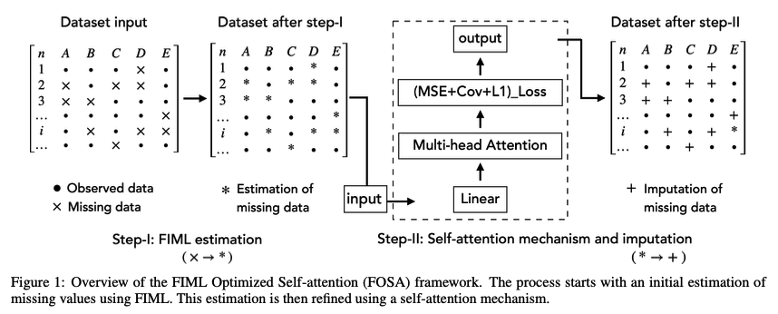

# FOSA: Full Information Maximum Likelihood (FIML) Optimized Self-Attention Imputation for Missing Data

## What's FOSA?
An innovative approach that amalgamates the strengths of Full Information Maximum Likelihood (FIML) estimation with the capabilities of self-attention neural networks. 

## Why FOSA?
Our comprehensive experiments on both simulated and real-world datasets underscore FOSA’s pronounced advantages over traditional FIML techniques, encapsulating facets of accuracy, computational efficiency, and adaptability to diverse data structures.

## FOSA paper
In the folder **/paper**, or see it at arXiv: [https://arxiv.org/submit/5075308
](https://arxiv.org/abs/2308.12388)
## FOSA code
In the folder **/code**. 
***FOSA_v2 recommended, as an utility with easy understood sample py code***.
