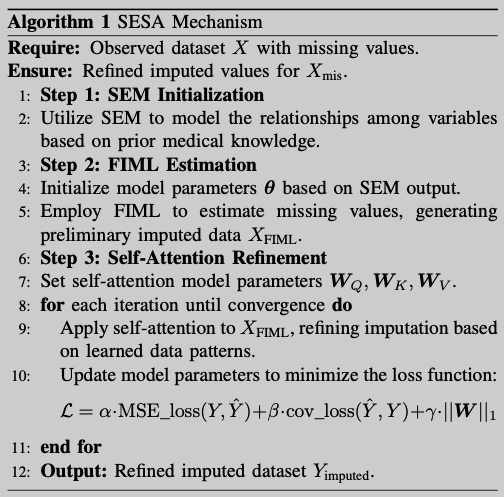
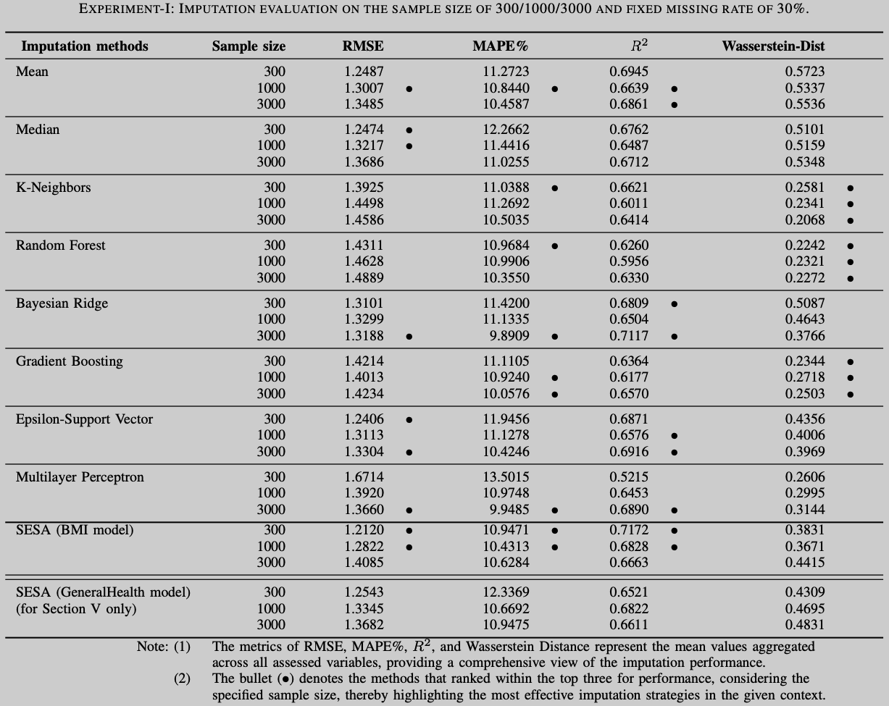

# SESA: Missing Data Imputation Based on Structural Equation Modeling Enhanced with Self-Attention

## What's SESA?
An innovative approach that amalgamates the strengths of Full Information Maximum Likelihood (FIML) estimation with the capabilities of Self-Attention neural networks. 

## Why SESA?
Our comprehensive experiments on both simulated and real-world datasets underscore SESA’s pronounced advantages over traditional baseline techniques, encapsulating facets of accuracy, computational efficiency, and adaptability to diverse data structures. Especially on small and middle size dataset.

## SESA paper (Under Review)
In the folder **/paper**, or see it at [arXiv](https://arxiv.org/abs/2308.12388).

## SESA code (Will be updated soon. Bcz I am struggling on another paper. At present, the old version of SESA is FOSA_v2.)
